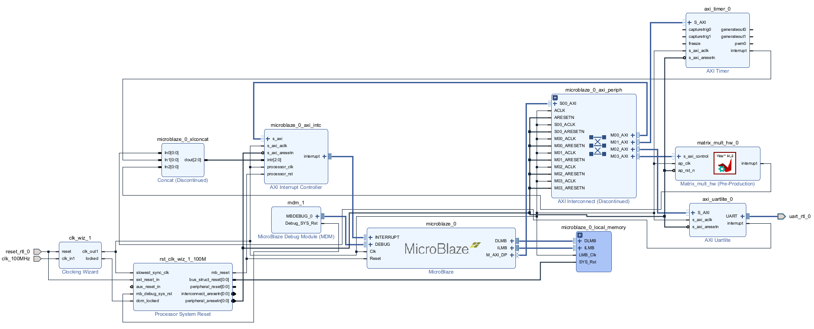

# Hardware (Vivado 2025.1)

Este diretório contém o projeto Vivado que integra o MicroBlaze e o IP de multiplicação de matrizes 16x16 gerado via Vitis HLS.

- Projeto: `acel_matrizes.xpr`
- Diagrama de blocos: `sources_1/bd/design_1/`
- Constraints: `acel_matrizes.srcs/constrs_1/new/netlist.xdc`
- Imagem de referência: `arquitetura_viv.png`

## Arquitetura

Design BD, com a IP HLS de multiplicação de matrizes, conexões AXI a periféricos e um MicroBlaze para controlar a comunicação.

## Abrir e gerar bitstream

1. Abra `acel_matrizes.xpr` no Vivado 2025.1
2. Execute Synthesis e Implementation
3. Gere o Bitstream

## Exportar XSA

Após o bitstream, exporte o hardware com bitstream:

- File > Export > Export Hardware
- Inclua Bitstream
- Salve em `../Software/platforms/` (ex.: `design_1_wrapper.xsa`)

## Observações

- O IP de multiplicação vem do submódulo `hls/` (Vitis HLS). Se atualizar o IP, reexecute a integração e regenere o bitstream.
- Ajuste os pinos e clocks no `netlist.xdc` conforme sua placa-alvo.
